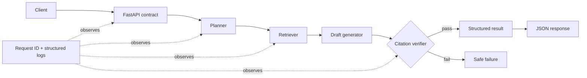

# Production AI Systems Blueprint

[](https://github.com/abuzar18/production-ai-systems-blueprint/actions/workflows/ci.yml)
[](https://www.python.org/)
[](https://fastapi.tiangolo.com/)
[](LICENSE)

A compact, model-independent reference implementation for building **verifiable AI services**, not just demos. The sample workflow plans an analysis task, retrieves supporting evidence, drafts a response, verifies citation coverage, and publishes a structured result through FastAPI.

It is intentionally runnable without an LLM key. The deterministic core makes architecture, tests, observability, and failure behavior easy to inspect; a real model or vector store can be added behind the existing interfaces.

## Why this repository exists

Production AI quality depends on the system around the model:

- explicit state transitions instead of opaque prompt chains;
- evidence carried into every claim;
- validation before an answer is published;
- health and readiness signals for orchestration;
- structured logs and request IDs for diagnosis;
- repeatable builds, tests, and CI/CD.

This repository demonstrates those patterns in a small codebase that a CTO or engineering team can review quickly.

## Architecture



## Included engineering patterns

- Layered API, domain, and pipeline modules
- Typed request/response contracts with Pydantic
- Deterministic planner → retriever → drafter → verifier stages
- Citation coverage checks and fail-closed behavior
- Correlation IDs and JSON-compatible event logs
- Liveness and readiness endpoints
- Docker image with a non-root runtime user
- Docker Compose health check
- Unit tests for success, rejection, ranking, and traceability
- GitHub Actions CI for tests and bytecode compilation

## Quick start

### Local Python

```bash
python -m venv .venv
source .venv/bin/activate  # Windows: .venv\Scripts\activate
pip install -r requirements.txt
uvicorn main:app --reload
```

### Docker

```bash
docker compose up --build
```

Open `http://localhost:8000/docs` for the interactive API documentation.

## Example request

```bash
curl -X POST http://localhost:8000/v1/analyze \
  -H "Content-Type: application/json" \
  -d '{
    "question": "How should we make this service reliable?",
    "documents": [
      {
        "source_id": "runbook",
        "title": "Reliability Runbook",
        "text": "Use health checks, request IDs, structured logs, automated tests, and rollback-ready deployments."
      },
      {
        "source_id": "security",
        "title": "Security Standard",
        "text": "Services must validate input, use least privilege, and avoid logging secrets."
      }
    ]
  }'
```

Example response (shortened):

```json
{
  "request_id": "9ee0...",
  "status": "verified",
  "answer": "The supplied evidence emphasizes health checks... [runbook]",
  "citations": [
    {"source_id": "runbook", "title": "Reliability Runbook", "score": 0.5}
  ],
  "trace": ["planned", "retrieved", "drafted", "verified"]
}
```

## API surface

| Method | Route | Purpose |
|---|---|---|
| `GET` | `/health` | Process liveness |
| `GET` | `/ready` | Dependency/readiness contract |
| `POST` | `/v1/analyze` | Run the evidence-backed workflow |

## Extension points

The deterministic components are deliberate seams for production integrations:

| Current component | Production replacement |
|---|---|
| token-overlap retriever | vector + lexical hybrid retrieval and reranking |
| extractive draft | Azure OpenAI, OpenAI, Bedrock, or local model adapter |
| in-process trace | OpenTelemetry plus managed logs/metrics |
| static documents | object storage, database, search index, or event stream |
| synchronous workflow | queue-backed workers with idempotency and retries |

## Production checklist

- Add authentication and tenant isolation.
- Store secrets in a managed secret store; never in source control.
- Add rate limiting, timeouts, bounded retries, and a circuit breaker.
- Evaluate with representative golden datasets before every release.
- Track quality, latency, cost, refusal rate, and citation accuracy by version.
- Add a human approval gate for consequential outputs.
- Threat-model prompt injection and untrusted retrieved content.

## Honest scope

This is a **reference implementation** built with synthetic examples. It contains no client code, confidential data, or proprietary prompts. Any professional metrics shown on [Abuzar Zulfiqar’s profile](https://github.com/abuzar18) describe sanitized engagement outcomes—not benchmarks produced by this sample repository.

## Author

**Abuzar Zulfiqar** — AI/ML Engineer & Solutions Architect

- [LinkedIn](https://www.linkedin.com/in/abuzar-zulfiqar/)
- [Upwork](https://www.upwork.com/freelancers/abuzarz4)

## License

MIT

